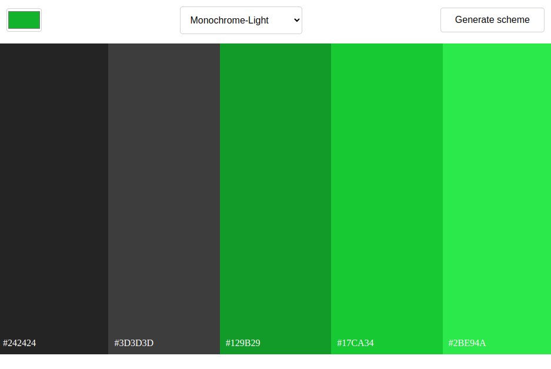

WORK IN PROGRESS

## Table of contents

- [Overview](#overview)
  - [About](#the-challenge)
  - [How to use](#usage)
  - [Screenshot](#screenshot)
  - [Links](#links)
- [My process](#my-process)
  - [Built with](#built-with)
  - [What I learned](#what-i-learned)

## Overview

### About

Color Scheme Picker: Dive into this fun app where you can pick a base color  and generate cool color schemes! Just choose your color and style, and watch as vibrant color divs pop up.  Click on any color to copy its hex code—easy peasy! Perfect for designers or anyone looking to spice up their projects.

### How to use

Simply choose seed color, choose scheme you want to be generated, 
click the magic button !

### Screenshot

### Links

- Live Site URL: [Color scheme picker live](https://color-scheme-picker-app.netlify.app)

## My process

### Built with

- HTML5
- CSS custom properties
- Flexbox
- Vanilla JavaScript

### What I learned

In this project, I learned how to interact with REST APIs using the fetch method. I found it super helpful to pre-code everything in a notebook first, which made transforming those ideas into real code much smoother.

- REST API
- fetch()
- precode everything in a notebook
